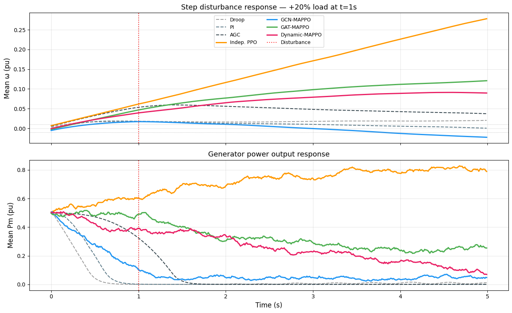

# Power Grid Frequency Regulation — MARL

MAPPO + GNN replacing classical Droop/PI/AGC controllers. Each generator is a decentralised agent communicating over the grid topology via message passing.



---

## Approach

| | Detail |
|---|---|
| **Agents** | Each generator (4 by default) |
| **Observation** | `[ω, δ, Pe, Pm, load]` — 5D local state |
| **Action** | `ΔPm` ∈ `[-0.1, 0.1]` pu |
| **Reward** | `−|ω| − 0.5·|mean(ω)| − action penalty` |
| **Comm.** | GNN over physical grid topology |
| **Algorithm** | MAPPO |

---

## Models

| Model | Description |
|---|---|
| `Indep. PPO` | No communication |
| `GCN-MAPPO` | Mean-aggregation GCN |
| `GAT-MAPPO` | Multi-head attention GAT |
| `Dynamic-MAPPO` | Learned sparse topology |

---

## Install

```bash
pip install -r requirements.txt
```

---

## Usage

```bash
# Train all models (saves to checkpoints/)
python train.py

# Options
python train.py --steps 500000 --topology mesh --device cuda

# Evaluate with disturbance response plots
python evaluate.py
python evaluate.py --save-fig results.png
```

---

## Results

Step disturbance: +20% load injected at t=1s on generator 0.

| Controller | Nadir ↓ | Settling (s) ↓ | SS Error ↓ |
|---|---|---|---|
| Droop | 0.02047 | ∞ | 0.01971 |
| PI | 0.01816 | 2.100 | 0.00240 |
| AGC | 0.05952 | ∞ | 0.03888 |
| Indep. PPO | 0.18153 | ∞ | 0.17399 |
| GCN-MAPPO | 0.26593 | ∞ | 0.25326 |
| GAT-MAPPO | 0.05728 | ∞ | 0.05318 |
| **Dynamic-MAPPO** | **0.06050** | ∞ | **0.05942** |

---

## Structure

```
├── power_grid_marl/
│   ├── env.py           # PowerGridEnv
│   ├── controllers.py   # Droop, PI, AGC
│   ├── gnn.py           # GCNLayer, GATLayer, DynamicGraphBuilder
│   ├── policies.py      # BaselinePolicy, GNNPolicy
│   ├── trainer.py       # RolloutBuffer, MAPPOTrainer
│   └── utils.py         # disturbance_test, plots
├── train.py
├── evaluate.py
└── power_grid_marl_(2).ipynb
```
